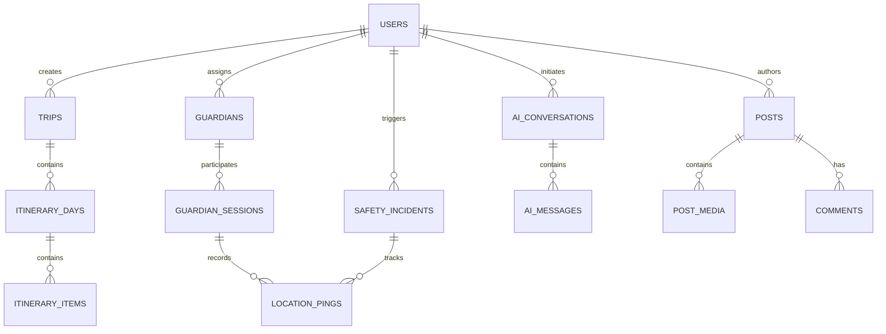

# HerShield: Phase 2A - Database Architecture

**Confidential Architecture Document**
*Role Context: Principal Database Architect, PostgreSQL Expert*

## Executive Summary
This document defines the highly scalable, highly secure PostgreSQL database architecture for HerShield. Utilizing Neon for serverless scaling, Drizzle ORM for type-safe interaction, and pgvector for AI capabilities, this design supports millions of concurrent female travelers while ensuring absolute data integrity, privacy, and real-time responsiveness.

---

## 1. Complete ER Diagram

### Relationship Explanations
- **One-to-Many (`USERS -> TRIPS`)**: A user can plan multiple trips over their lifetime.
- **One-to-Many (`USERS -> GUARDIANS`)**: A user can have multiple trusted emergency contacts.
- **Many-to-Many (Resolved via `GUARDIAN_SESSIONS`)**: A session involves a traveler and specific guardians tracking them.
- **One-to-Many (`TRIPS -> ITINERARY_DAYS -> ITINERARY_ITEMS`)**: Standard nested hierarchy for travel itineraries.
- **One-to-Many (`AI_CONVERSATIONS -> AI_MESSAGES`)**: Standard chat history grouping.

---

## 2. Database Modules

To prevent monolith entanglement, the database is logically grouped into modules (schemas or naming prefixes):

1. **`auth_*` / `iam_*`**: Users, Sessions, Verifications. (Foundation for trust).
2. **`trips_*`**: Trips, Itineraries. (Core value).
3. **`safety_*`**: Incidents, Location Pings, Guardians. (High-velocity, high-priority).
4. **`comm_*`**: Posts, Comments, Reviews. (Social layer).
5. **`ai_*`**: Conversations, Vector Embeddings, Prompts. (pgvector intensive).
6. **`audit_*` & `analytics_*`**: System logs, usage metrics. (Append-only).
7. **`ref_*`**: Static reference data (Countries, Cities).

*Why:* Modularity allows for easier horizontal partitioning (e.g., sharding the `safety_*` tables independently of `ref_*` tables) as the platform scales.

---

## 3. Complete Table List & 4. Column Design (Key Tables)

### Module: `iam` (Identity)
**Table: `users`**
- Purpose: Core identity record.
- Expansion: Support for future enterprise/B2B SSO.
| Column | Type | Nullable | Default | Index/Key | Description |
| :--- | :--- | :--- | :--- | :--- | :--- |
| `id` | `uuid` | No | `gen_random_uuid()` | PK | Primary identifier |
| `email` | `varchar(255)` | No | - | Unique, B-Tree | Login/Notification email |
| `role` | `varchar(50)` | No | `'GUEST'` | - | Guest, Verified, Moderator |
| `verification_status` | `varchar(50)` | No | `'PENDING'` | B-Tree | For community gating |
| `created_at` | `timestamptz` | No | `now()` | - | - |
| `deleted_at` | `timestamptz` | Yes | `null` | - | Soft delete for GDPR |

### Module: `safety` (High Velocity)
**Table: `location_pings`**
- Purpose: Ephemeral/Permanent tracking of user location.
- Constraints: High insert volume. Requires partitioning by time.
| Column | Type | Nullable | Default | Index/Key | Description |
| :--- | :--- | :--- | :--- | :--- | :--- |
| `id` | `uuid` | No | `gen_random_uuid()` | PK | - |
| `session_id` | `uuid` | Yes | - | FK (`guardian_sessions`) | Link to active tracking |
| `incident_id` | `uuid` | Yes | - | FK (`safety_incidents`) | Link to active SOS |
| `lat` | `float8` | No | - | - | Latitude |
| `lng` | `float8` | No | - | - | Longitude |
| `geom` | `geometry(Point, 4326)` | No | - | GiST | PostGIS index for geo-queries |
| `timestamp` | `timestamptz` | No | `now()` | BRIN | Time of ping |

### Module: `ai` (pgvector)
**Table: `ai_memories`**
- Purpose: Store vector embeddings of user preferences or past trip summaries to give the AI context.
| Column | Type | Nullable | Default | Index/Key | Description |
| :--- | :--- | :--- | :--- | :--- | :--- |
| `id` | `uuid` | No | `gen_random_uuid()` | PK | - |
| `user_id` | `uuid` | No | - | FK (`users`) | - |
| `content` | `text` | No | - | - | Text string to embed |
| `embedding` | `vector(1536)` | No | - | HNSW | pgvector for similarity |

*(Note: Other tables like `trips`, `posts`, `audit_logs` follow similar strict UUID + Timestamp patterns).*

---

## 5. Primary Keys

**Strategy:** UUIDv4 or UUIDv7 (generated via `gen_random_uuid()` or application side).
- **Generation:** Handled primarily by the database default to ensure consistency, but application can supply them.
- **Benefits:** 
  1. Prevents ID enumeration (attackers cannot scrape users 1 through 10,000).
  2. Safe for offline mobile app creation (offline users can generate a UUID trip, then sync).
  3. Seamless merging during database sharding.

---

## 6. Foreign Keys

**Rules:**
- **Cascade Delete (`ON DELETE CASCADE`)**: Used for strong aggregations. Example: If a `trip` is deleted, its `itinerary_days` are cascadingly deleted. If a `post` is deleted, `comments` are deleted.
- **Set Null (`ON DELETE SET NULL`)**: Used for weak associations. Example: If a `user` is deleted (soft/hard), their `safety_incidents` might have `user_id` set to null or kept for legal compliance.
- **Restrict (`ON DELETE RESTRICT`)**: Used to prevent accidental deletion of critical reference data (e.g., preventing deletion of a `country` if trips are assigned to it).

---

## 7. Index Strategy

1. **B-Tree Indexes**: Standard for exact matches and sorting (e.g., `email`, `created_at`).
2. **BRIN Indexes (Block Range Index)**: Extremely efficient for append-only time-series data like `location_pings` and `audit_logs`.
3. **GiST Indexes**: Used with PostGIS for spatial searches (e.g., "Find active users within 5km of this SOS").
4. **HNSW (Hierarchical Navigable Small World)**: Used via pgvector on `embedding` columns for ultra-fast Approximate Nearest Neighbor (ANN) searches when the AI is fetching context.
5. **Partial Indexes**: Used for boolean flags (e.g., `CREATE INDEX active_sos ON safety_incidents(created_at) WHERE status = 'ACTIVE'`).

---

## 8. AI Ready Design

To natively support LLMs, the database incorporates:
- **`vector(1536)` Columns**: Standard sizing for OpenAI `text-embedding-3-small`.
- **RAG Architecture**: The `ai_memories` table stores chunked text of users' past reviews and preferences, allowing semantic search to inject personal context into prompts.
- **Prompt Logs**: `ai_conversations` and `ai_messages` store exact token usage, model versions, and cost metrics for financial analytics.

---

## 9. Realtime Ready Design

- **Optimized for WebSockets/LiveKit**: High-velocity inserts like `location_pings` are separated from mutating tables.
- **Listen/Notify**: PostgreSQL `LISTEN/NOTIFY` can be utilized via Drizzle/Neon to broadcast row-level changes (e.g., `safety_incidents` status updates) directly to the Hono backend for pushing to connected clients.
- **Row-Level TTL**: Expired live trips or presence states can be swept via cron jobs without locking the main user table.

---

## 10. Audit & 11. Analytics Tables

**Audit Tables (Security Focus)**
- `audit_security_logs`: Tracks failed logins, role changes, verification approvals. Immutable.
- `audit_device_history`: Maps `user_id` to `device_id`, IP address, and Push Token.

**Analytics Tables (Product Focus)**
- `analytics_events`: Raw event stream (`event_name`, `user_id`, `metadata` JSONB).
- *Decision:* Use JSONB for `metadata` to allow frontend flexibility without DB migrations for every new funnel metric.

---

## 12. Soft Delete Strategy

- **Implementation**: A `deleted_at` timestamp column.
- **Where**: `users`, `trips`, `posts`.
- **Why**: 
  1. Accidental deletions of complex trips can be restored.
  2. Legal/GDPR compliance requires retaining SOS and incident logs even if the user deletes their account.
- **Mechanism**: Drizzle queries must strictly append `.where(isNull(table.deleted_at))` (usually abstracted in the Repository layer).

---

## 13. File Storage Mapping

Database does **not** store binaries. It maps to **Cloudflare R2** via URL/URI strings:
- `users.avatar_url`: Public read bucket.
- `posts_media.file_url`: Public read bucket.
- `verifications.document_uri`: **Private** bucket with short-lived presigned URLs.
- `safety_incidents.audio_recording_uri`: **Private** encrypted bucket.

---

## 14. Migration Strategy

1. **Order of Execution**:
   - `0000_init` (Enable extensions: `uuid-ossp`, `pgvector`, `postgis`).
   - `0001_reference` (Countries, Enums).
   - `0002_iam` (Users, Roles).
   - `0003_core` (Trips, Safety, AI).
   - `0004_relations` (Foreign key constraints).
2. **Tooling**: Drizzle Kit for declarative schema diffing.
3. **Rollback**: Every migration must be non-destructive. Destructive changes (dropping columns) must be deployed in multi-phase rollouts (Add new -> Migrate data -> Drop old).

---

## 15. Seed Strategy

Static data injected during environment initialization (`scripts/seed.ts`):
- `ref_countries`: ISO codes, names.
- `ref_safety_categories`: Enum strings (e.g., "Well Lit", "Female Friendly").
- `ref_travel_tags`: "Solo", "Adventure", "Relaxation".

---

## 16. Repository Layer Design

Direct Drizzle ORM calls in business logic are forbidden. All access goes through strict repositories.

- `UserRepository`: Handles identity. Automatically filters out soft-deleted users.
- `TripRepository`: Aggregates complex joins (Trips + Days + Items) into unified JSON structures for the frontend.
- `SafetyRepository`: Highly optimized for rapid inserts (pings) and critical updates (SOS resolution).
- `AIRepository`: Handles vector cosine similarity searches using `pgvector` specific raw SQL interpolations within Drizzle.

---

## 17. Performance Optimization

- **Connection Pooling**: Neon provides built-in pgbouncer/pooling.
- **Partitioning**: `location_pings` will be table-partitioned by `month`. Old partitions can be archived to cold storage.
- **Materialized Views**: Used for community feed aggregation (e.g., `mv_trending_destinations` refreshed nightly) to save CPU.
- **JSONB Aggregation**: Repositories use `jsonb_agg` to fetch a Trip and its entire Itinerary in a single fast query rather than N+1 queries.

---

## 18. Security & Privacy (GDPR)

1. **Encryption at Rest**: Handled transparently by Neon.
2. **PII Masking**: Fields like `users.phone_number` and `users.date_of_birth` are stored in separate restricted tables, heavily audited on read.
3. **Data Residency**: Support for deploying Neon read-replicas in EU jurisdictions for GDPR compliance.
4. **Row Level Security (RLS)**: While business logic sits in Hono, PostgreSQL RLS can be applied as a defense-in-depth mechanism to ensure `tenant_id` (or `user_id`) isolation at the database kernel level.
