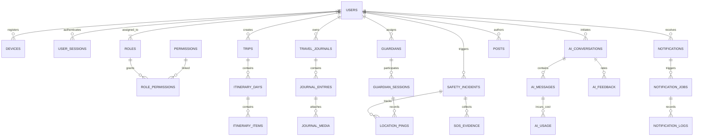

# HerShield: Phase 2A - Final Database Architecture Refinement

**Confidential Architecture Document**
*Role Context: Principal Database Architect, PostgreSQL Expert*

## Executive Summary
This document defines the highly scalable, highly secure PostgreSQL database architecture for HerShield. Utilizing Neon for serverless scaling, Drizzle ORM for type-safe interaction, and pgvector for AI capabilities, this design supports millions of concurrent female travelers while ensuring absolute data integrity, privacy, and real-time responsiveness. This refined iteration introduces enterprise-grade extensions for auditing, AI tracking, advanced RBAC, and system events.

---

## 1. Complete ER Diagram & Relationships

---

## 2. Database Modules

1. **`iam_*` (Identity & Access Management):** `users`, `devices`, `user_sessions`, `roles`, `permissions`, `role_permissions`.
2. **`trips_*`:** `trips`, `itinerary_days`, `itinerary_items`, `travel_journals`, `journal_entries`, `journal_media`.
3. **`safety_*`:** `safety_incidents`, `location_pings`, `guardians`, `guardian_sessions`, `sos_evidence`, `location_safety_scores`.
4. **`comm_*`:** `posts`, `comments`, `reviews`.
5. **`ai_*`:** `ai_conversations`, `ai_messages`, `ai_usage`, `ai_prompt_templates`, `ai_feedback`, `ai_embeddings` (extended).
6. **`notif_*`:** `notifications`, `notification_jobs`, `notification_logs`.
7. **`sys_*` & `analytics_*`:** `system_events`, `search_history`, `recommendation_cache`.
8. **`ref_*`:** `ref_countries`, `emergency_services`.

---

## 3. Complete Table List & 4. Column Design (Extended Modules)

### 3.1 Device & Session Management
*Why: Even with Better Auth, custom device tracking is required for robust Push Notification routing and remote session wiping (e.g., if a user's phone is stolen).*

**Table: `devices`**
- `id` (uuid, PK)
- `user_id` (uuid, FK users)
- `device_name` (varchar, e.g. "Sarah's iPhone")
- `platform` (varchar, iOS/Android/Web)
- `os_version` (varchar)
- `app_version` (varchar)
- `push_token` (varchar, Nullable)
- `is_trusted` (boolean, default false)
- `last_seen_at` (timestamptz)

**Table: `user_sessions`**
- `id` (uuid, PK)
- `user_id` (uuid, FK users)
- `device_id` (uuid, FK devices)
- `session_token` (varchar, Unique)
- `refresh_token` (varchar, Unique)
- `ip_address` (inet)
- `user_agent` (text)
- `location_approx` (varchar)
- `expires_at` (timestamptz)
- `revoked_at` (timestamptz, Nullable)

### 3.2 Notification Queue
**Tables: `notifications`, `notification_jobs`, `notification_logs`**
- Decouples notification intent from delivery mechanism.
- `notification_jobs` supports `status` (PENDING, PROCESSING, FAILED, DELIVERED), `retry_count`, and `provider` (APNs, FCM, Twilio).

### 3.3 AI Ops (Usage, Templates, Feedback)
*Why: Critical for calculating OpenAI/Anthropic burn rate per user and optimizing prompts dynamically.*

**Table: `ai_usage`**
- `id` (uuid, PK), `user_id` (uuid, FK), `provider` (varchar), `model` (varchar), `input_tokens` (int), `output_tokens` (int), `latency_ms` (int), `estimated_cost` (numeric(10,6)).
**Table: `ai_prompt_templates`**
- `id` (uuid), `version` (int), `category` (varchar), `system_prompt` (text), `variables` (jsonb), `is_active` (boolean).
**Table: `ai_feedback`**
- `id` (uuid), `conversation_id` (uuid, FK), `rating` (int, 1-5 or -1/1), `report_reason` (varchar), `comments` (text).

### 3.4 Advanced Safety & SOS
**Table: `sos_evidence`**
- `id` (uuid, PK), `incident_id` (uuid, FK), `media_type` (varchar: AUDIO, VIDEO, IMAGE), `file_url` (varchar, R2 link), `transcript` (text). *Linked securely to R2.*
**Table: `location_safety_scores`**
- `id` (uuid), `geom` (geometry Polygon/Point), `safety_score` (numeric 0-100), `confidence_level` (numeric), `source` (varchar: AI/Crowdsource), `updated_at` (timestamptz).

### 3.5 Travel Journal
**Tables: `travel_journals`, `journal_entries`, `journal_media`**
- Allows private tracking of trips with notes, photos, and AI-generated daily summaries attached securely to a `trip_id`.

### 3.6 Role & Permission System (RBAC)
- Custom RBAC (`roles`, `permissions`, `role_permissions`) built alongside the Auth provider to handle complex startup operations (e.g., giving a specific Moderator permissions to view only European SOS tickets).

### 3.7 Search, Caching, and Event Store
**Table: `search_history`**
- Tracks `query`, `filters` (JSONB), and `results_count` for analytics.
**Table: `recommendation_cache`**
- Stores pre-computed AI suggestions (e.g., "Top 10 safe hotels in Paris") with a TTL to drastically reduce AI token costs.
**Table: `system_events` (Append-Only)**
- `id` (uuid), `event_type` (varchar: TRIP_CREATED, SOS_TRIGGERED, etc.), `actor_id` (uuid), `metadata` (jsonb). Serves as the ultimate source of truth for audibility and future Event-Driven Architecture (Kafka/SQS bridging).

---

## 5. Primary Keys & 6. Foreign Keys

- **UUID Strategy:** Utilizing `uuidv7` where possible for time-sorted sequential inserts, preventing B-Tree fragmentation on massive tables like `location_pings` and `system_events`.
- **Cascade Rules:** 
  - `SOS_EVIDENCE` -> `ON DELETE RESTRICT` (Legal requirement).
  - `JOURNAL_ENTRIES` -> `ON DELETE CASCADE` (Tied to user/trip).

---

## 7. Index Strategy

- **Location Search:** PostGIS `GiST` index on `location_safety_scores(geom)`.
- **Event Sourcing:** `BRIN` index on `system_events(created_at)` and `location_pings(timestamp)`.
- **AI Analytics:** B-Tree on `ai_usage(user_id, created_at)` for fast monthly billing/burn rate aggregation.

---

## 8. Extended AI Embeddings (pgvector)

We expand `vector(1536)` beyond user memories to create a **Universal Semantic Search**:
1. `ai_hotel_embeddings`: Matches user safety criteria against aggregated hotel safety reviews.
2. `ai_destination_embeddings`: Semantic matching for "quiet beach towns with low crime".
3. `ai_post_embeddings`: Allows users to search the Community Feed semantically (e.g., "someone lost their passport in Rome").

---

## 13. File Storage Mapping (Cloudflare R2)

- **`sos_evidence.file_url`**: Private bucket. Requires extreme ACLs. URLs are never public. Fetched via short-lived backend presigned URLs.
- **`journal_media.file_url`**: Private bucket.
- **`posts_media.file_url`**: Public CDN bucket.

---

## 16. Database Architecture Review (Final Analysis)

After integrating the 16 new modules, the architecture was reviewed for enterprise readiness:

### Strengths & Expansions
- **Scalability via Event Sourcing:** The `system_events` table completely decouples side-effects. Instead of complex triggers, microservices can tail this table for analytics and notifications.
- **Cost Control:** `recommendation_cache` and `ai_usage` tables directly mitigate the risk of unchecked LLM API bankruptcy—a major risk for AI startups.
- **Legal Compliance:** `sos_evidence` and `system_events` are strictly append-only or `RESTRICT` on delete, ensuring chain-of-custody for emergency situations.

### Potential Bottlenecks Identified & Mitigated
1. **Performance Issue: Table Bloat on `location_pings` and `system_events`.**
   - *Mitigation:* Immediately implement Native Table Partitioning (`PARTITION BY RANGE (timestamp)`) grouped by Month.
2. **Security Risk: `session_token` leakage.**
   - *Mitigation:* The `user_sessions` table tokens must be hashed (`sha256`) in the database. The raw token is only returned once to the client upon creation.
3. **Duplicate Tables:** `user_sessions` overlaps slightly with Better Auth's default session handling. 
   - *Decision:* We will sync Better Auth's session hooks into our enriched `user_sessions` table to attach our custom `device_id` and `push_token` mappings.

### Future Expansion Notes
- **Wearables:** The `devices` table is prepared for `platform: "watchOS"`, allowing Apple Watches to push directly to `location_pings` independent of the iPhone.
- **Enterprise Safety:** The RBAC tables (`roles`, `permissions`) allow HerShield to easily pivot to B2B (e.g., Companies managing travel safety for their female employees) by adding a `tenant_id` column to isolate data.
