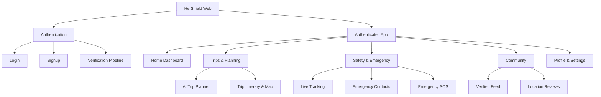
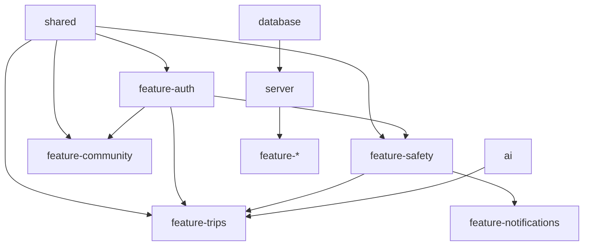

# HerShield: Phase 1.5 - Product Architecture & UX Blueprint

This document serves as the master blueprint for the product architecture, user experience, and technical mappings for HerShield, a production-grade AI-powered travel and safety platform for women.

---

## 1. Complete Screen Inventory

### Web Application (Traveler Facing)
**Public / Unauthenticated:**
- `W-01` Landing Page
- `W-02` About / Mission
- `W-03` Login
- `W-04` Signup / Registration
- `W-05` Identity Verification (Onboarding)

**Authenticated (Dashboard):**
- `W-06` Home Dashboard (Overview)
- `W-07` AI Trip Planner (Chat Interface)
- `W-08` Trip Details & Itinerary
- `W-09` Safety Hub (Real-time tracking, active alerts)
- `W-10` Emergency / SOS Mode (High contrast, quick actions)
- `W-11` Community Feed (Discussions, reviews)
- `W-12` Community Post Detail
- `W-13` User Profile
- `W-14` Settings (Privacy, Emergency Contacts, Preferences)

### Admin Application (Moderator / Admin Facing)
- `A-01` Admin Login
- `A-02` Admin Dashboard (System health, active incidents)
- `A-03` Identity Verification Queue (Manual review of travelers)
- `A-04` Incident Response Center (Managing active SOS alerts)
- `A-05` User Management (Ban, promote, verify)
- `A-06` Platform Analytics

---

## 2. Information Architecture

---

## 3. User Flows

### A. Strict Identity Verification Flow
1. User creates account (Email/OAuth).
2. User is prompted for Identity Verification (required for Community/Safety access).
3. User uploads Government ID & takes live selfie (Integration with verification provider / manual review).
4. Profile status is set to `Pending Verification`.
5. Upon approval, role is upgraded from `Guest` to `Verified Traveler`.

### B. AI Trip Planning Flow
1. User navigates to AI Trip Planner.
2. User provides prompt: *"I want a 3-day solo trip to Tokyo focusing on safe, female-friendly hostels and well-lit areas."*
3. AI Agent streams response, dynamically rendering an interactive itinerary UI.
4. User clicks "Save to Trips".
5. Background job calculates safety scores for the route via Mapbox and database stats.

### C. Emergency SOS Flow
1. User activates SOS via UI slider or widget.
2. System immediately logs GPS coordinates.
3. Automated SMS/WhatsApp notifications sent to Emergency Contacts.
4. Alert broadcasted to Admin Incident Response Center.
5. (Optional) LiveKit audio streaming starts recording background audio securely.

---

## 4. Navigation Structure

**Web (Desktop View):**
- **Sidebar (Persistent):** Home, Trips, Community, Safety, Profile.
- **Top Bar:** Search, Notifications, Active Trip Status, SOS Button (always visible, red highlight).

**Web (Mobile View):**
- **Bottom Navigation Tab Bar:** Home, Trips, SOS (Center, Prominent), Community, Profile.
- **Header:** Contextual actions, Notifications.

---

## 5. Component Inventory (packages/ui & packages/design-system)

**Core UI (shadcn/ui based):**
- `Button` (Primary, Secondary, Destructive for SOS, Ghost)
- `Card` (Trip summaries, Post snippets)
- `Dialog/Sheet` (Modals for quick edits, AI chat slide-outs)
- `Avatar` (User images with verification badges)
- `Badge` (Safety scores: High, Medium, Low)
- `Form/Input/Select` (Booking, settings, planning)

**Domain-Specific UI:**
- `AIChatInterface`: Streaming text blocks, suggested prompts.
- `ItineraryTimeline`: Vertical timeline of planned stops.
- `SafetyMap`: Mapbox GL component with heatmaps for safety scores.
- `SOSSlider`: "Slide to activate SOS" to prevent accidental triggers.
- `VerificationBadge`: Shield icon with holographic CSS effect.

---

## 6. Feature Dependency Graph

*Note: Auth is foundational. Safety informs Trips. AI powers Trips.*

---

## 7. Screen-to-Database Mapping

| Screen / Feature | Primary Tables Accessed (Drizzle Schema) |
| :--- | :--- |
| **Auth & Verification** | `users`, `sessions`, `accounts`, `verifications` |
| **Profile & Settings** | `users`, `emergency_contacts`, `user_preferences` |
| **AI Trip Planner** | `trips`, `trip_days`, `locations`, `ai_conversations` (pgvector for embeddings) |
| **Safety Hub & SOS** | `safety_incidents`, `location_pings`, `users` |
| **Community Feed** | `posts`, `comments`, `likes`, `location_reviews` |
| **Admin Dashboard** | `users`, `safety_incidents`, `verifications` |

---

## 8. Screen-to-API Mapping

**API Prefix:** `/api/v1`

| Screen | tRPC / Hono Router Path | Action |
| :--- | :--- | :--- |
| **Auth** | `auth.*` (Handled mostly by Better Auth) | Login, Register, Verify |
| **Trips** | `trips.generateAI` (Streaming) | Generate itinerary via Agent |
| **Trips** | `trips.listUserTrips` (Query) | Fetch saved trips |
| **Safety** | `safety.triggerSOS` (Mutation) | High-priority incident creation |
| **Safety** | `safety.updateLocation` (Mutation) | Background telemetry ping |
| **Community**| `community.getFeed` (Query) | Fetch paginated posts |

---

## 9. MVP vs Future Roadmap

### MVP (Phase 2 & 3)
- Strict Auth & Manual Verification (`Verified Traveler`).
- AI Trip Generation (OpenAI/Anthropic) with basic interactive UI.
- Mapbox integration for viewing itineraries.
- Basic SOS Button (Updates DB, triggers in-app notification).
- Community Feed (Text + Image posts).

### Future Roadmap
- **Hardware Integration**: Bluetooth panic button integration.
- **LiveKit Streaming**: Auto-stream audio/video to trusted contacts during SOS.
- **Automated Verification**: Integration with Stripe Identity or Onfido.
- **AI Local Guide Agents**: Real-time contextual voice agents.
- **Offline Mode**: Local-first sync for itineraries when internet drops.

---

## 10. Wireframe Descriptions (Blueprint)

### `W-06` Home Dashboard
- **Header**: "Welcome back, [Name]". Verification badge next to name.
- **Hero Card**: Active or Upcoming Trip summary with a mini-map snippet.
- **Quick Actions**: "Plan new trip with AI", "Share Live Location".
- **Safety Status**: A persistent widget showing current city safety rating and local emergency numbers (911/112).
- **Recent Community Activity**: Carousel of recent highly-rated posts from verified women.

### `W-07` AI Trip Planner
- **Layout**: Split screen (Desktop). Left is a chat interface, right is a dynamic Map/Itinerary view.
- **Chat**: User types constraints. Agent responds and simultaneously injects "Itinerary Card" components into the chat stream.
- **Map**: Automatically pans and zooms to the city being discussed, dropping pins for recommended safe hotels.

### `W-10` Emergency SOS Mode
- **Visuals**: Dark/Red high-contrast theme. Overrides system brightness if possible.
- **Primary Element**: Large "Slide to Cancel" within 10 seconds.
- **Secondary Elements**: Large buttons to silently dial police, dial emergency contact, or sound loud alarm.
- **Background Status**: "Recording audio...", "Broadcasting location...".

### `A-03` Identity Verification Queue (Admin)
- **Layout**: Data table of pending users.
- **Detail View**: Split pane showing user-uploaded selfie vs. ID card.
- **Actions**: Approve (Promote to Verified Traveler), Reject (Request clearer photo), Ban.
