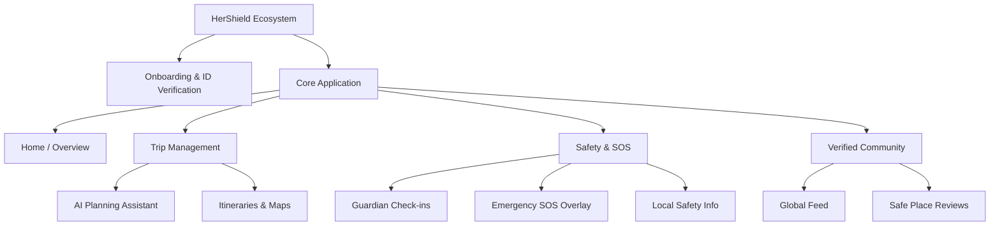
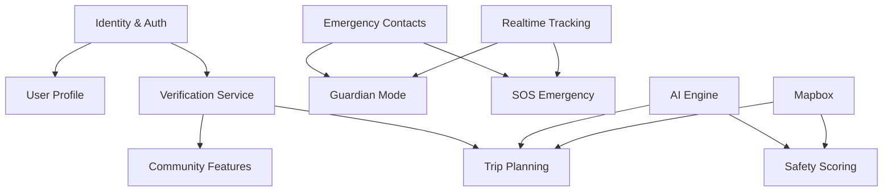

# HerShield: Phase 1.5 - Product Architecture & UX Blueprint

**Confidential Product & Technical Blueprint**
*Target Audience: Investors, Principal Engineers, Design Leads, Product Managers.*

## Executive Summary
HerShield is a comprehensive AI-powered travel and safety ecosystem designed exclusively for women. The platform transcends traditional travel planning by integrating safety, community, and emergency support at a foundational level.

---

## 1. Complete Screen Inventory

### 1.1 Web/Mobile Web Application (Traveler)

**Authentication & Onboarding**
- `W-AUTH-01` Landing / Value Proposition
- `W-AUTH-02` Login (OAuth / Magic Link)
- `W-AUTH-03` Signup & Account Creation
- `W-AUTH-04` Identity Verification (Gov ID + Selfie)
- `W-AUTH-05` Verification Pending State
- `W-AUTH-06` Emergency Contacts Setup

**Dashboard & Navigation**
- `W-DASH-01` Home (Active trip snapshot, Quick SOS, Weather/Safety alerts)
- `W-DASH-02` Search & Discover (Destinations, safe zones)

**Trips & AI Planning**
- `W-TRIP-01` My Trips List (Past, Present, Future)
- `W-TRIP-02` AI Trip Planner Chat (Streaming UI)
- `W-TRIP-03` Trip Detail Overview (Itinerary)
- `W-TRIP-04` Interactive Trip Map (Mapbox)
- `W-TRIP-05` Hotel/Accommodation Detail (Safety scores highlighted)

**Safety & Guardian Mode**
- `W-SAFE-01` Safety Hub (Local emergency info, Embassy details)
- `W-SAFE-02` Guardian Mode Setup (Select contacts, set duration)
- `W-SAFE-03` Guardian Active State (Countdown timer, check-in button)
- `W-SAFE-04` Emergency SOS Slider (High contrast, instant action)

**Community**
- `W-COMM-01` Community Feed (Chronological/Algorithm-sorted posts)
- `W-COMM-02` Post Detail & Comments
- `W-COMM-03` Create Post (Rich text, media, location tag)
- `W-COMM-04` Destination Reviews (Female-centric safety reviews)

**Profile & Settings**
- `W-PROF-01` User Profile (Travel memories, badges)
- `W-PROF-02` Account Settings
- `W-PROF-03` Privacy & Permissions (Location tracking toggles)
- `W-PROF-04` Emergency Contacts Management

### 1.2 Admin / Moderator Dashboard
- `A-AUTH-01` Admin Secure Login (MFA required)
- `A-DASH-01` System Overview (Active SOS, Server Health)
- `A-USER-01` Verification Queue (Manual ID review)
- `A-USER-02` User Management (Ban, promote, suspend)
- `A-SAFE-01` Incident Response Center (Live tracking of active SOS)
- `A-COMM-01` Moderation Queue (Flagged posts/reviews)

---

## 2. Information Architecture

**Hierarchy Principles:** Flat navigation to ensure safety features are never more than 1 click away.

---

## 3. User Journeys

### 3.1 First-Time User (Onboarding)
- **Goal:** Gain trust, securely verify identity, and set up safety net.
- **Pain Point:** Verification can feel intrusive.
- **Opportunity:** Frame ID verification as the ultimate safety feature to keep bad actors out.
- **Emotion:** Reassurance and Trust.

### 3.2 Solo Traveler (Trip Planning & Execution)
- **Goal:** Plan a 5-day trip to Paris with high safety confidence.
- **Journey:** Opens AI Planner -> Asks for safe neighborhoods -> AI generates itinerary -> User shares itinerary with Guardian.
- **Pain Point:** Overwhelming research on neighborhood safety.
- **Opportunity:** AI distills global safety data into actionable, safe itineraries.
- **Emotion:** Empowerment and Excitement.

### 3.3 Emergency Situation (SOS)
- **Goal:** Get immediate help without drawing attention.
- **Journey:** User feels unsafe -> Opens app -> Uses SOS Slider (1-swipe) -> Screen dims to conceal activity -> Live location and audio stream to guardians & admins.
- **Pain Point:** Panic reduces cognitive ability to navigate complex menus.
- **Opportunity:** 1-click/1-swipe ubiquitous access.
- **Emotion:** Fear shifting to Relief knowing help is active.

---

## 4. Navigation System

**Decision: Hybrid Navigation (Bottom Nav + Floating Contextual Actions)**

- **Mobile Web (Primary Target):** Fixed Bottom Navigation Bar.
  - *Why:* Ergonomic for one-handed use (critical when walking alone with luggage).
  - *Tabs:* Home, Trips, SOS (Center, Prominent, distinct color), Community, Profile.
- **Floating Actions:** Contextual FABs for "Add Post" or "New Trip".
- **Top Bar:** Strictly reserved for contextual back buttons, settings icons, and real-time network status indicators.

---

## 5. Component Inventory

**Core Primitives (shadcn/ui + Tailwind v4):**
- `Button`: Primary, Secondary, Ghost, Destructive (Reserved for SOS/Deletions).
- `Card`: The foundational container for trips, posts, and settings.
- `BottomSheet`: Used for complex forms (e.g., adding emergency contacts) to keep users in context without full page reloads.

**Domain-Specific Components:**
- `SafetyBadge`: A visually distinct pill (Green/Yellow/Red) indicating area safety based on real-time data.
- `TripCard`: Displays destination image, dates, and a mini-safety badge.
- `AIChatBubble`: Supports markdown, inline Mapbox markers, and actionable buttons ("Add to itinerary").
- `SOSSlider`: "Slide to activate" component. *Why:* Prevents accidental triggers better than a button press.
- `TimelineNode`: Used in itineraries to show chronological travel plans.

---

## 6. Feature Dependency Graph

---

## 7. Screen → Database Mapping

| Screen | Core Entities Read | Core Entities Written |
| :--- | :--- | :--- |
| **Verification (W-AUTH-04)** | `users` | `verifications`, `users.status` |
| **Dashboard (W-DASH-01)** | `trips`, `safety_alerts`, `users` | `location_pings` |
| **AI Planner (W-TRIP-02)** | `users.preferences`, `destinations` | `ai_conversations`, `trips`, `itineraries` |
| **Guardian Mode (W-SAFE-02)** | `emergency_contacts` | `guardian_sessions`, `location_pings` |
| **SOS Overlay (W-SAFE-04)** | `emergency_contacts` | `safety_incidents`, `location_pings` |
| **Community (W-COMM-01)** | `posts`, `users`, `comments` | `posts`, `likes`, `comments` |

---

## 8. Screen → API Mapping

| Screen | Read APIs | Write / Mutation APIs | Realtime / Streams |
| :--- | :--- | :--- | :--- |
| **AI Planner** | `trips.getHistory` | `trips.save` | Streaming via AI SDK for chat response |
| **Guardian Mode** | `safety.getContacts` | `safety.startSession`, `safety.checkIn` | WebSocket via LiveKit for location tracking |
| **SOS Emergency** | `safety.getInstructions`| `safety.triggerSOS` | WebRTC for background audio streaming |
| **Community Feed** | `community.getFeed` | `community.createPost`, `community.like` | N/A |

---

## 9. MVP Roadmap

### Version 1: The Core Safety & AI Engine (Current Scope)
- Identity verification (Stripe Identity or Manual).
- AI Trip Planner (Text-to-Itinerary).
- Basic SOS (SMS to emergency contacts + DB logging).
- Read-only safety information via Maps.
*Why:* Establishes the core value proposition (AI + Basic Safety) to acquire initial users.

### Version 2: The Guardian & Community Update
- Guardian Mode (Check-ins, live location sharing).
- Verified Community Feed (Posts, reviews).
- Push notifications via FCM/APNs.
*Why:* Drives retention and network effects.

### Version 3: Advanced Hardware & Realtime
- LiveKit streaming during SOS (Audio/Video).
- Automated risk scoring based on live global events.
- Wearable integration (Apple Watch SOS trigger).
*Why:* Elevates the product to an enterprise-grade safety tool.

---

## 10. Wireframe Blueprint

### Screen: W-10 Emergency SOS Mode
- **Header:** Hidden to reduce distraction. A persistent red status bar at the very top indicates "SOS ACTIVE".
- **Body:** Dark mode enforced. Deep red background gradient. 
- **Center Action:** `SOSSlider` spanning 80% of the screen width. Text: "Slide for Emergency".
- **Secondary Actions:** `Button` (Ghost, White text): "Silent Police Dispatch", `Button` (Ghost): "Sound Alarm".
- **Animations:** Gentle pulsing animation on the slider track to draw the eye in high-stress situations.

### Screen: W-07 AI Trip Planner
- **Header:** Back button, Title: "Plan a Trip", Settings icon.
- **Body (Flex Layout):** 
  - **Scrollable Chat Area:** `AIChatBubble` components alternate between user and AI. AI bubbles have a distinct, softer background (e.g., subtle purple).
  - **Floating Action Bar (Bottom):** Text input anchored to the bottom with a primary submit button.
- **Interactions:** When AI suggests an itinerary, the chat bubble includes a `Button` "View on Map". Clicking it slides up a `BottomSheet` containing the `SafetyMap`.

---

## 11. UX Guidelines

- **Navigation Rules:** No dead ends. Every screen must have a clear "Back" or "Close" action. Bottom navigation must remain visible unless typing in a chat or on the SOS screen.
- **Interaction Rules (One-Handed Usage):** Critical touch targets (SOS, Next steps, Chat input) must exist in the bottom 40% of the screen.
- **Loading States:** Skeleton loaders matching the exact shape of incoming data. Avoid full-screen spinners. AI streaming must show characters instantly.
- **Error States:** Empathetic, non-technical language. E.g., "We couldn't reach the map server right now. Your safety features are still fully operational."
- **Empty States:** Action-oriented. Instead of "No trips", use "Plan your first safe adventure with our AI".
- **Success States:** Subtle haptic feedback (vibration via Web/Device APIs) paired with brief toast notifications.

---

## 12. Product Design Principles

1. **Safety First:** Security overrides convenience. ID verification is mandatory; there are no exceptions to protect the community.
2. **Minimal Cognitive Load:** In an emergency, a user's IQ effectively drops. Safety features require zero reading and rely on muscle memory (e.g., sliding a massive button).
3. **One-Handed Usage:** Users often carry luggage or hold a bag. Navigation must accommodate thumb-only use.
4. **Trust by Design:** Absolute transparency. If location is being tracked, a persistent, un-dismissible banner must clearly state it.
5. **AI Assistance Without Overwhelm:** AI should suggest, not mandate. The interface should feel like a collaborative chat with an expert, not a rigid form.

---

## 13. Complete Feature Matrix

| Feature | Priority | Complexity | Dependencies | Business Value | User Value | Dev Phase |
| :--- | :--- | :--- | :--- | :--- | :--- | :--- |
| **ID Verification** | P0 (Blocker) | High | feature-auth | High (Trust) | High (Safety) | V1 |
| **AI Trip Planner** | P1 | High | AI Package | High (Acquisition) | High | V1 |
| **SOS Basic** | P1 | Low | feature-safety | High | Critical | V1 |
| **Guardian Mode** | P2 | Medium | Realtime/Maps | Medium | High | V2 |
| **Community Feed** | P3 | High | Verification | High (Retention) | Medium | V2 |
| **LiveKit SOS Stream**| P4 | Very High | Realtime | Low (Niche) | Critical | V3 |

---

## 14. Risk Analysis

- **UX Risks:** ID Verification causes user drop-off. *Mitigation:* Offer a "guest mode" that lets them browse AI trip generation, but locks Community and SOS until verified.
- **Technical Risks:** AI hallucinations suggesting unsafe locations. *Mitigation:* Enforce an intermediate validation layer where AI outputs are cross-referenced against the pgvector database of known safe zones before rendering to the user.
- **Security Risks:** Bad actors bypassing verification to stalk women. *Mitigation:* Multi-factor KYC (Gov ID + Liveness check) and strict community reporting tools with automatic IP bans.
- **Scalability Risks:** High volume of location pings during Guardian mode killing the database. *Mitigation:* Use Redis/Cloudflare KV for ephemeral location data, only syncing to PostgreSQL on session end or SOS trigger.

---

## 15. Future Expansion Architecture

The Turborepo + Clean Architecture approach guarantees future extensibility:
- **Wearables / Smart Rings:** By keeping business logic in `packages/server` and exposing versioned APIs (`/api/v1`), an Apple Watch app or Smart Ring backend can trigger `safety.triggerSOS` directly without requiring UI modifications.
- **International Travel (Offline Mode):** Data fetching will be abstracted behind TanStack Query and PWA service workers, allowing offline caching of itineraries and local emergency numbers.
- **Voice Assistant:** The `packages/ai` module uses decoupled tools. A future voice interface simply passes transcribed text into the exact same AI agents used by the text chat UI.
- **Enterprise Safety:** Future B2B pivots (e.g., protecting female journalists) can be handled by creating a new app in the monorepo (`apps/enterprise`) that consumes the same `packages/feature-safety` logic with stricter SSO requirements.
